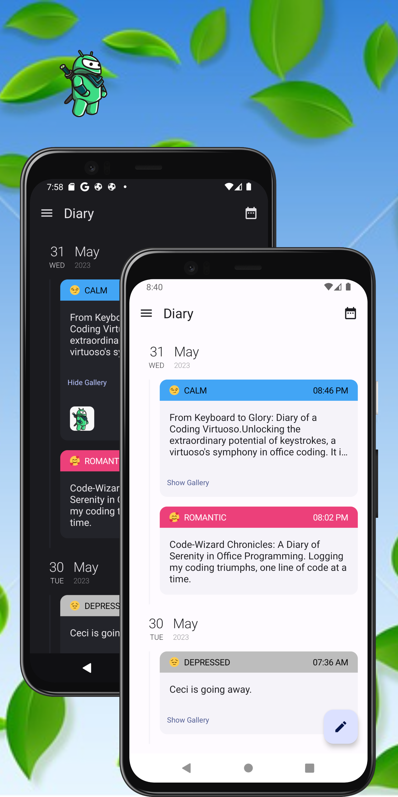
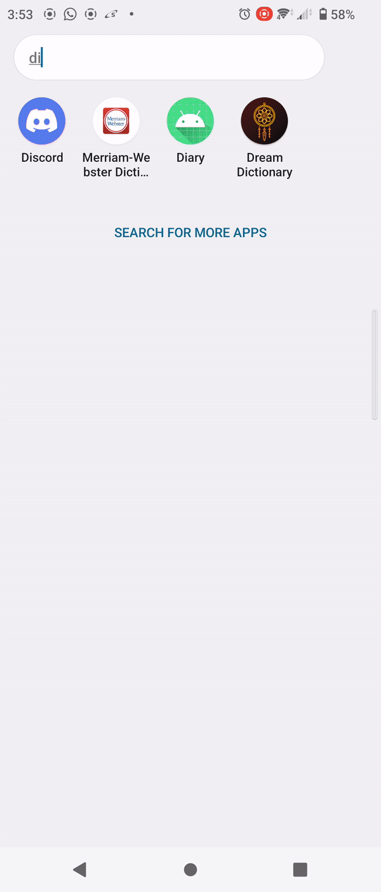

# Dairy-App
DiaryApp allows users to write and save diary entries with the option to include photos and expressive emojis to capture the essence of each moment. 

 &nbsp;&nbsp;&nbsp;&nbsp;
 &nbsp;&nbsp;&nbsp;&nbsp;   
 &nbsp;&nbsp;&nbsp;&nbsp; 

Here's an overview of the app's architectural modular components:
- **App Module**: This is the main module of the DiaryApp, whhich acts as the orchestrator of the different features and modules. It handles the navigation flow between the Authentication, Home, and the Write features, ensuring a cohesive and seamless user experience. The App Module integrates the dependencies from the feature modules and manages the overall lifecycle of the app.

- **buildSrc**: The buildSrc module serves as a central location for managing project configuration and dependencies. This module allows for a streamlined and standardized setup of project configurations, build scripts, and dependencies, simplifying the build process and ensuring consistency across the app.

- **Data Module**:The Data module in the Android Diary App is responsible for managing data storage and retrieval using both MongoDB and Room. It handles the setup and integration of Mongo Realm, allowing seamless connectivity to the MongoDB backend. The Data module provides functionalities for inserting, fetching, updating, and deleting diary entries in the MongoDB database. Additionally, DiaryApp leverages Room Librayto provide offline access and local caching of diary entries, enhancing the app's responsiveness and offline capabilities.

- **Common/Core Modules**: The app includes two core modules: *UI* and *Utils*. The UI module contains common Compose functions, components, and UI-related code that are shared across different features. This module promotes code reuse and consistency in the app's user interface. The Utils module provides essential utilities such as model classes, connectivity observers, constants, strings and drawable resources. It ensures a centralized and efficient management of commonly used resources and functionalities.

- **Feature Modules**: This module includes three destinations: Auth, Home and Write. 'Auth' handles the authentication with the users. 'Home' displays all the data/diaries in our application. And 'Write' module allows you to create a new diary note in your app.

### Navigation
The app has :three: screen destinations which use Compose Navigation to manage navigation.

| :feature:auth                       | :feature:home                       | :feature:write                      |
|-------------------------------------|-------------------------------------|-------------------------------------|
|  |  |  |

- **Authentication Feature**: This feature focuses on user authentication and validation. It utilizes Google Sign-In to ensure that users can securely access their diary entries. By authenticating users, the app guarantees that only authorized individuals can interact with their personal diaries.

- **Home Feature**: The Home feature is responsible for displaying and filtering diary entries based on the date. It provides a user-friendly interface to navigate through diary entries and quickly filter diaries by specific dates. Additional selections can be accessed through the Navigation Drawer.

- **Write Feature**: The Write feature enables users to create new diary entries or modify existing ones. It offers a seamless and intuitive interface for users to capture and document their thoughts, moments, and memories. DiaryApp empowers the users to personalize content by adding emojis and accompanying images

